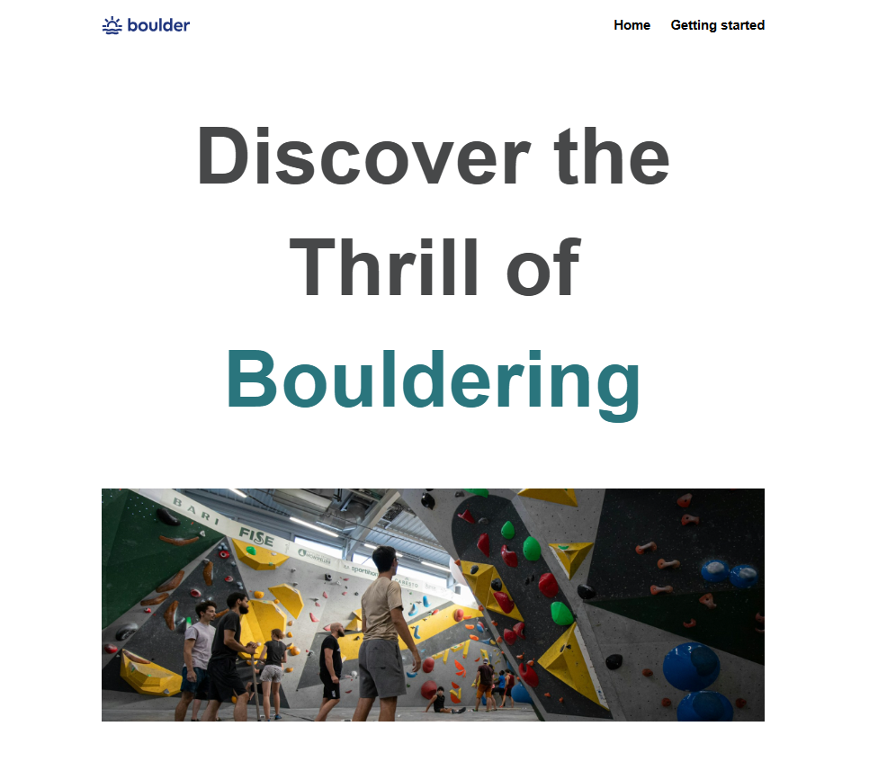

# Hi there 👋  

I’m **Ayla**, a passionate **Frontend Developer in training** 🚀  
Currently focused on **building responsive and interactive websites** and learning step by step.  

---

## 🛠️ Skills  

  

---

## 📊 GitHub Stats  

  
  

---

## 🚀 Featured Projects  

## 🚀 Featured Projects  

<table>
  <!-- 1. Satır -->
  <tr>
    <td width="50%" align="center" valign="top">
      <h3>My First Project</h3>
      
        
      

        
        
      

      
<strong>HTML, CSS</strong>

    </td>
  <td width="50%" align="center" valign="top">
      <h3>My Third Project</h3>
      
        
      

        
        
      

      
<strong>HTML, CSS</strong>

    </td>
    
  </tr>

  <!-- 2. Satır -->
  <tr>
    <td width="50%" align="center" valign="top">
      <h3>My Third Project</h3>
      
        
      

        
        
      

      
<strong>HTML, CSS</strong>

    </td>
      <td width="50%" align="center" valign="top">
      <h3>My Third Project</h3>
      
        
      

        
        
      

      
<strong>HTML, CSS</strong>

    </td>
    </tr>
    <tr>
        <td width="50%" align="center" valign="top">
      <h3>My Third Project</h3>
      
        
      

        
        
      

      
<strong>HTML, CSS</strong>

    </td>
        <td width="50%" align="center" valign="top">
      <h3>My Third Project</h3>
      
        
      

        
        
      

      
<strong>HTML, CSS</strong>

    </td>
    </tr>

     
  
</table>

---

✨ *Always learning, always building...*
