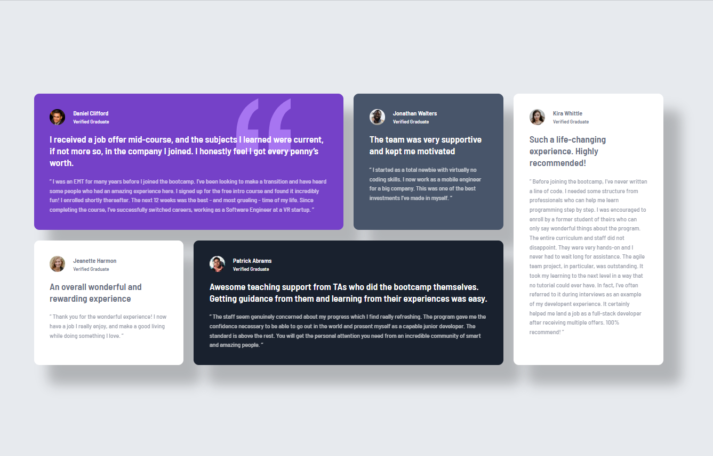
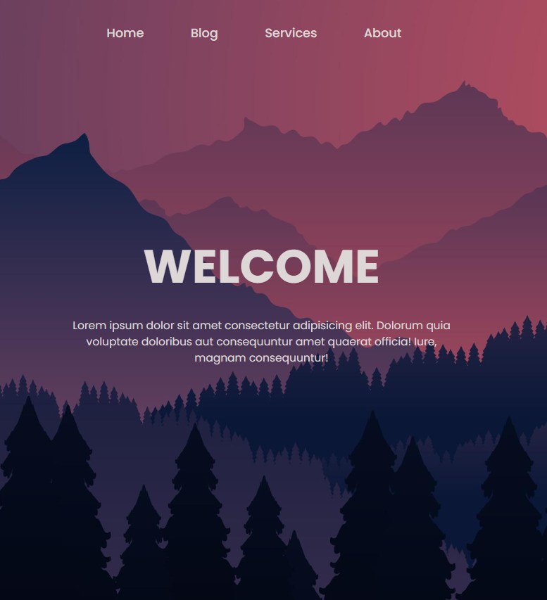
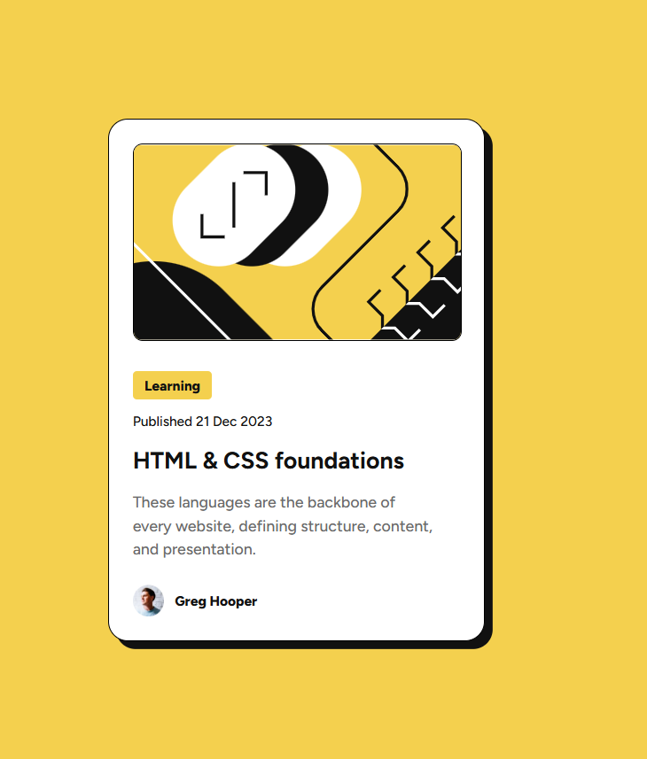
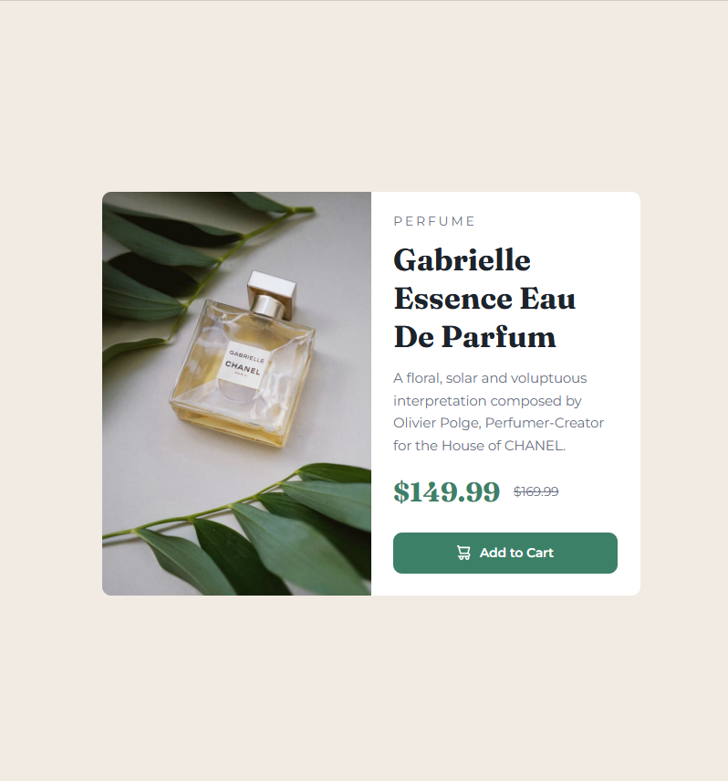
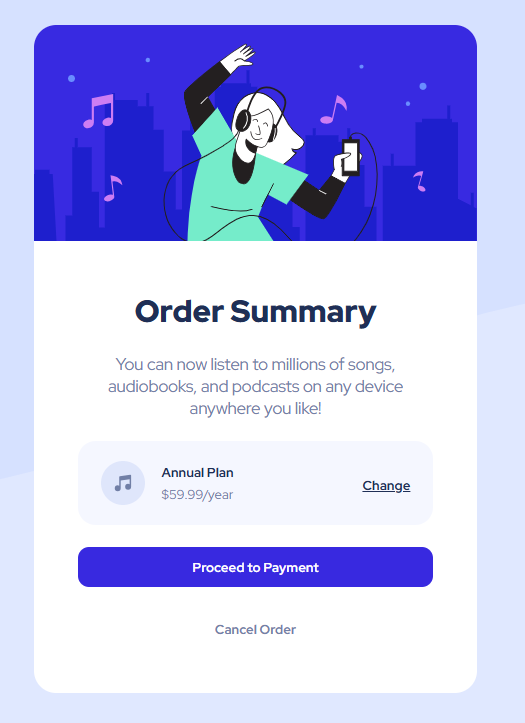
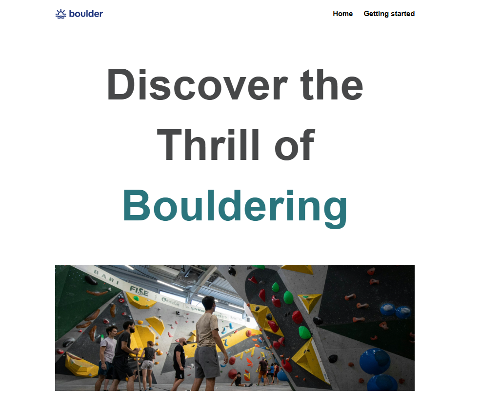

# Hi there 👋  

I’m **Ayla**, a passionate **Frontend Developer in training** 🚀  
Currently focused on **building responsive and interactive websites** and learning step by step.  

---

## 🛠️ Skills  

  

---

## 📊 GitHub Stats  

  
  

---

## 🚀 Featured Projects  
 

<table>
  <!-- 3. Satır -->
  <tr>
     <td width="50%" align="center" valign="top">
      <h3>My Responsive Grid Project</h3>
      
        
      

        
        
      

      
<strong>HTML, CSS</strong>

        
    </td>
    
   <td width="50%" align="center" valign="top">
      <h3>Login Form</h3>
      
        
      

        
        
      

      
<strong>HTML, CSS</strong>

      
     </td>
    
  </tr>

  <!-- 2. Satır -->
  
  <tr>
    
  <td width="50%" align="center" valign="top">
      <h3>My First Figma Project</h3>
      
        
      

        
        
      

      
<strong>HTML, CSS, Figma</strong>

     
     </td>
    
  <td width="50%" align="center" valign="top">
      <h3>Product Preview </h3>
      
        
      

        
        
      

      
<strong>HTML, CSS</strong>

     
    </td>
    
  </tr>

 <!-- 1. Satır -->
  
  <tr>
    
  <td width="50%" align="center" valign="top">
      <h3>Order Summary</h3>
      
        
      

        
        
      

      
<strong>HTML, CSS</strong>

     
     </td>
    
  <td width="50%" align="center" valign="top">
      <h3>My First Project</h3>
      
        
      

        
        
      

      
<strong>HTML, CSS</strong>

     
    </td>
    </tr>

     
  
</table>

---

✨ *Always learning, always building...*
